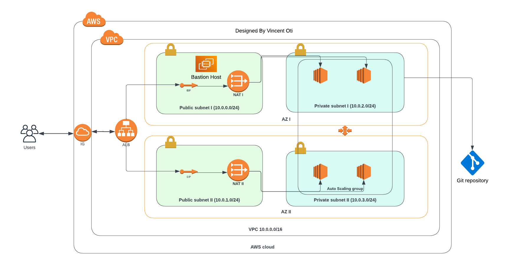

## DEPLOY A HIGHLY AVAILABLE WEB APPLICATION ON AWS WITH CLOUDFORMATION

#### The business goal

A company is creating an Instagram clone called Udagram.
Developers want to deploy a new application to the AWS infrastructure.
This repository contains code to provisioning the required infrastructure and deploying the application,
along with the necessary supporting software.

#### Project requirements

1. AWS Account
2. Install and configure AWS CLI

#### Project files

1. network-stack.yaml file - code to setup the network infrastructure (VPC -Public and Private Subnets -Internet Gateway -NAT Gateway -Elastic IP address and -Route Tables)
2. server-stack.yaml file - code to create the compute resources (Load Balancer -Autoscaling Group - IAM roles - Target Groups -EC2 Launch configuration)
3. network-parameters.json file - Network parameters
4. server-parameters.json file - Compute parameters

##### STEPS

1. clone repository
2. navigate to the cloned folder
3. run this command `aws cloudformation create-stack --stack-name network-stack --region us-east-1 --template-body file://network-stack.yml --parameters file://network-params.json` to create the network infrastructure
4. run this command `aws cloudformation create-stack --stack-name compute-stack --region us-east-1 --template-body file://server-stack.yml --parameters file://server-params.json` to create the compute infrastructure
